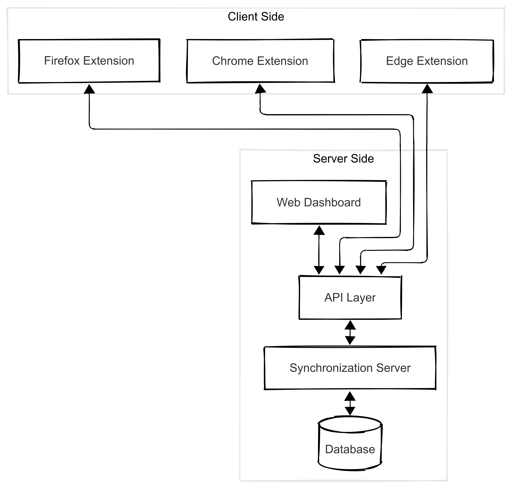

## 2. Overall Description

### 2.1 Software Perspective

Tazamun is a new, self-contained open-source software system that enables cross-browser data synchronization. While existing solutions provide synchronization within their respective browsers, Tazamun uniquely operates across different browser platforms.

The system consists of several key components:

- Browser Extensions: Native extensions for each supported browser that handle data capture, transformation and local data synchronization.
- Synchronization Server: A central component that manages storage, all synchronization operations and conflict resolution.
- Database: A database system for securely storing synchronized browser data, including data about bookmarks, history, extensions, and tabs.
- API Layer: RESTful API that facilitate communication between browser extensions and the synchronization server.
- Web Dashboard: A web-based interface for users to manage their synchronization settings and view synchronized data.

Tazamun interacts with browser APIs for data access but operates independently of existing browser synchronization services. This independence ensures that Tazamun can continue functioning regardless of changes to browser-specific sync services while maintaining compatibility with various browser versions and platforms.

### 2.2 Software Features

Tazamun provides two primary feature groups that enable seamless cross-browser synchronization:

- **Data Synchronization**

  - Bookmark synchronization across browsers
  - Tabs synchronization for seamless browser switching
  - Browsing history synchronization
  - Browser extension tracking and installation assistance
- **User Control and Management**

  - Web-based dashboard for managing synchronization settings on the server side
  - Customizable synchronization settings for each data type through an intuitive interface
  - Native browser extension interfaces
  - Visual controls to pause/resume synchronization
  - Data import/export capabilities

### 2.3 User Classes and Characteristics

- **Regular Users**
  Individuals who use multiple browsers day-to-day with varying levels of technical knowledge. They use the core synchronization features through browser extensions and dashboard controls. Some users may utilize advanced features and customization options for managing their synchronized data.
- **System Administrators**
  Technical professionals who deploy and maintain Tazamun instances. They manage the server-side components, handle database administration, and ensure system security and performance.

### 2.4 Operating Environment

The software will mainly operate in server environments that support .NET Core and web technologies such as JavaScript and Node.js. The software is designed to be platform-independent and can run on any server operating system, including Windows and Linux, as long as they meet the required software dependencies.

- **Server Platforms**: The software can be deployed on bare-metal servers, virtual machines (VMs), or through containerization technologies such as Docker or Kubernetes, providing flexibility in deployment and scaling.
- **Hardware Requirements**:
  - **CPU**: A dual-core processor is the general recommendation for running the software efficiently.
  - **RAM**: Minimum 1GB RAM recommended.
  - **Disk Space**: Base installation requires 300MB. Recommended 2GB for software operation (logs, temp files, etc.). Additional storage planning required based on expected user data volume.
- **Database Requirements**: The software will use a MySQL database for storing configuration, system state, and browser data. This will not generate a large amount of data, so basic database setups are sufficient.
- **Network Requirements**: A stable and reliable network and/or internet connection is required for optimal performance. HTTPS support and a Valid SSL certificate are required for secure communication.
- **Software Dependencies**: The software relies on external technologies like .NET Core for backend services and Node.js for the frontend user interface.

### 2.5 Design and Implementation Constraints

The following design and implementation constraints apply to the development of the Software:

- **Hardware Limitations**
  The software must be capable of running efficiently on hardware with limited resources, such as low-end server. Performance must remain acceptable with minimal CPU and memory.
- **Database Constraints**
  The software will use a SQL-based relational database to store configuration, state, and browser data. No large volumes of data are expected, but the software must be designed to efficiently manage the database interactions without overwhelming the database server or causing performance bottlenecks in small deployments.
- **Platform Constraints**
  - NET Core must be used for backend services and the API, limiting the options for programming languages and frameworks that can be used. Node.js and Vue.js will be used for the frontend, which restricts the choice of frontend frameworks and libraries.
  - The software must be cross-platform, which introduces the need for platform-agnostic solutions.
  - The software must comply with Docker containerization standards, as it will be deployed using Docker in many environments. This requires a consistent and lightweight Docker image to minimize deployment issues.
- **Security Considerations**
  - The software must implement user authentication and authorization mechanisms to control access to the API and user interface, ensuring that unauthorized users cannot access or query the api.
  - All sensitive data must be encrypted both at rest and in transit:
    - Data stored in the database must be encrypted
    - Communications between browser extensions and the server must use secure protocols
    - User credentials and personal data must be protected with strong encryption
    - Encryption keys must be properly managed and secured
- **Browser Extension Constraints**
  - Must comply with each browser's extension development guidelines and security policies
  - Limited by browser-specific API restrictions and permissions
  - Must handle different data formats across browsers
- **Network Constraints**
  - Must handle network interruptions gracefully
  - Implement retry mechanisms for failed synchronization attempts
  - Handle concurrent synchronization requests efficiently
- **Development Standards**
  - Code must be well-documented for open-source contribution
  - Must follow consistent coding standards across all components
  - Must implement proper error handling and logging
  - Version control and change management procedures must be followed

### 2.6 User Documentation

The following documentations will be delivered with the software:

- **End User Documentation**

  - Quick Start Guide for browser extension installation and basic usage
  - User Manual covering all features and configurations
  - Troubleshooting guide for common issues
  - FAQ document addressing common questions and concerns
- **System Administrator Documentation**

  - Installation and Configuration Guide
  - Database Setup Guide#
  - Backup and Recovery Guide
- **General Documentation**

  - Project README with overview and basic setup instructions
  - Changelog documenting version updates
  - License information and terms of use
  - Contributing guidelines

All documentation will be maintained in Markdown format and hosted on the project's GitHub repository and will be updated with each software release.

### 2.7 Assumptions and Dependencies

The following assumptions and dependencies have been identified for the development of the Software:

- **Containerization**:

  - It is assumed that the software will primarily be deployed using Docker or other container technologies. Therefore, the software's configuration, installation, and operation are dependent on the availability of Docker or an equivalent container runtime.
  - The successful operation of the software on non-containerized environments is considered secondary, and issues related to non-containerized environments may not be prioritized.
- **Database**:

  - The software assumes the availability of a SQL database (e.g., MySQL, PostgreSQL) for storing configuration, state, and browser data.
- **Users**

  - Users have basic knowledge of browser extensions and their installation
  - System administrators have basic knowledge of server management
- **Browsers**

  - Web browsers support the required extension APIs
  - Supported browsers remain backward compatible with their extension APIs
